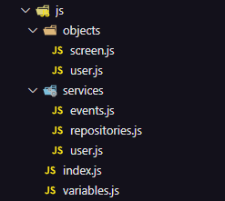

# Projeto Busca de usuários do Github

Este projeto é um site que permite buscar usuários utilizando a API do GitHub.

## Glossário

- [Visão geral](#visão-geral)
  - [Sobre](#sobre)
  - [Screenshots](#screenshots)
- [Meu processo](#meu-processo)
  - [Dificuldades e aprendizados](#dificuldades-e-aprendizados)
  - [Desenvolvido com](#desenvolvido-com)
- [Autor](#autor)

## Visão geral

### Sobre

O objetivo deste site é exibir informações detalhadas sobre o usuário do GitHub solicitado, incluindo seu nome, biografia, número de seguidores, quantidade de pessoas que ele segue, lista de repositórios e suas atividades mais recentes na plataforma.

### Screenshots

#### Exemplo do site

## Meu processo

Este projeto foi desenvolvido como parte do curso DevQuest. Inicialmente, acompanhamos o professor na criação da estrutura principal, e depois nos foi solicitado que adicionássemos novas funcionalidades, como:

- Exibir o número de seguidores e a quantidade de pessoas que o usuário segue
- Mostrar informações sobre os eventos mais recentes do usuário no GitHub
- Exibir a quantidade de forks, estrelas, watchers e a linguagem de programação de cada repositório

Embora não tenha sido solicitado, decidi fazer algumas alterações na responsividade do projeto. Percebi que alguns elementos poderiam ser aprimorados para oferecer uma experiência mais agradável em dispositivos diferentes, então ajustei o layout para torná-lo mais responsivo e visualmente consistente.

### Dificuldades e aprendizados

Sem dúvidas, algo que eu gostei bastante de aprender foi a parte da refatoração do código. Inicialmente nós fizemos tudo em apenas um arquivo de script e depois refatoramos de uma forma bem mais organizada e legível, designando tarefas específicas para cada arquivo, deixando assim o projeto bem mais facil de dar manutenção, fazer alterações e adicionar novas funcionalidades.

### Desenvolvido com

- HTML
- CSS
- Flexbox
- Javascript
- API (GitHub REST API)

## Autor

- GitHub - [itsdavss](https://github.com/itsdavss)
- Meu portfólio - [Davi Oliveira](https://itsdavss.github.io/portfolio-davi/)
- LinkedIn - [Davi Oliveira dos Santos](https://www.linkedin.com/in/davi-oliveira-dos-santos/)
